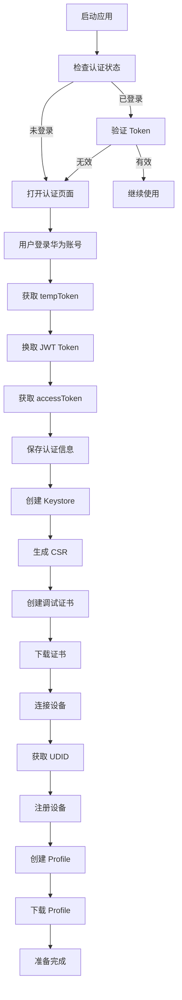
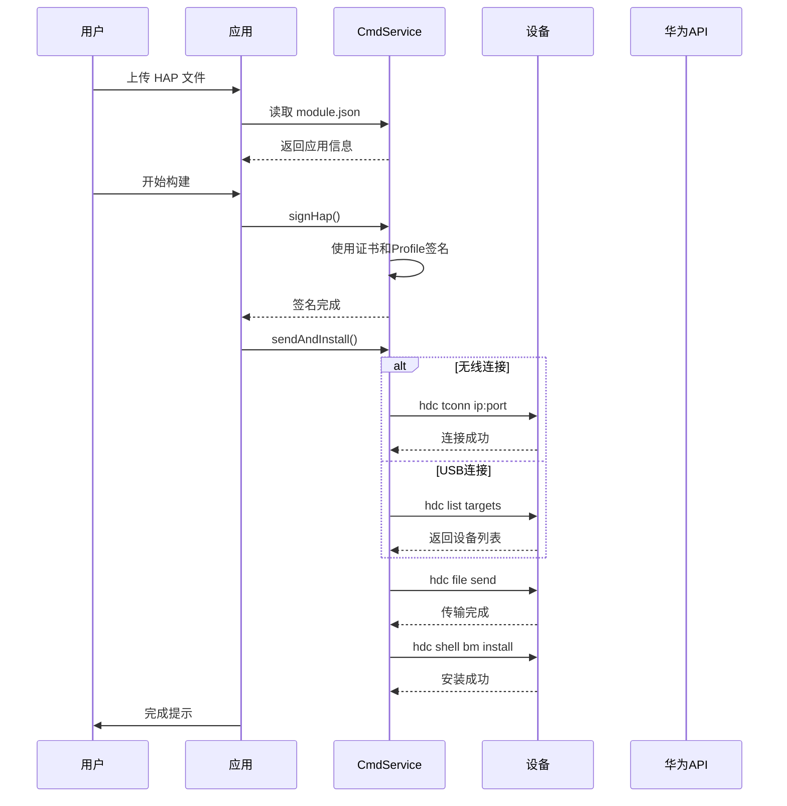

# 鸿蒙 HDC 调试和认证技术文档

## 目录
- [1. 概述](#1-概述)
- [2. HDC 调试功能](#2-hdc-调试功能)
- [3. 华为开发者认证流程](#3-华为开发者认证流程)
- [4. API 接口说明](#4-api-接口说明)
- [5. 常见问题](#5-常见问题)

---

## 1. 概述

本项目实现了鸿蒙应用的自动签名和安装功能，主要包括：
- **HDC 设备调试**：设备连接、文件传输、应用安装
- **华为开发者认证**：通过 DevEco Studio 认证系统获取 Token
- **证书和配置文件管理**：自动创建和下载调试证书、Profile

---

## 2. HDC 调试功能

### 2.1 HDC 简介

HDC (HarmonyOS Device Connector) 是鸿蒙系统的设备连接工具，类似于 Android 的 ADB。

**核心功能：**
- 设备列表获取
- 无线调试连接
- 文件传输
- 应用安装/卸载
- Shell 命令执行

### 2.2 当前实现的 HDC 功能

#### 2.2.1 设备列表获取
```javascript
async deviceList() {
    let result = await this.exeCmd(`${this.hdc} list targets`)
    if (result.indexOf("[Empty]") > -1) {
        return []
    } else {
        return result.split("\n").filter(d => d != '')
    }
}
```

**HDC 命令：** `hdc list targets`
**返回格式：** 
```
192.168.1.100:5555
FMR0223C13000649
[Empty]  // 无设备时返回
```

#### 2.2.2 无线设备连接
```javascript
async connectDevice(device) {
    let result = await this.exeCmd(`${this.hdc} tconn ${device}`)
    if (result == "" || result.indexOf("Connect failed") > -1) {
        throw new Error("连接失败，请检查地址" + device)
    } else {
        console.debug("connectDevice:" + device, result)
    }
}
```

**HDC 命令：** `hdc tconn <ip:port>`
**使用场景：** 通过 IP 地址和端口连接设备（需在同一局域网）
**前提条件：**
- 设备开启「开发者选项」
- 开启「USB 调试」和「无线调试」
- 设备和电脑在同一局域网

#### 2.2.3 获取设备 UDID
```javascript
async getUdid(device = '127.0.0.1:5557') {
    let deviceT = ""
    if (device) {
        deviceT = "-t " + device
    }
    let result = await this.exeCmd(`${this.hdc} ${deviceT} shell bm get --udid`)
    if (result.indexOf("Not match target founded") > -1) {
        throw Error("未发现设备:" + device)
    }
    let udid = result.split("\n")[1]
    console.log(udid)
    return udid
}
```

**HDC 命令：** `hdc [-t device] shell bm get --udid`
**UDID 用途：** 
- 创建调试 Profile 时必须绑定设备 UDID
- 用于设备白名单管理

#### 2.2.4 文件传输
```javascript
async sendFile(device = '127.0.0.1:5557', filePath = "entry-default-unsigned.hap") {
    let deviceT = ""
    if (device) {
        deviceT = "-t " + device
    }
    // 清理临时目录
    await this.exeCmd(`${this.hdc} ${deviceT} shell rm -r data/local/tmp/hap`)
    // 创建目录
    await this.exeCmd(`${this.hdc} ${deviceT} shell mkdir -p data/local/tmp/hap`)
    // 发送文件
    let result = await this.exeCmd(`${this.hdc} ${deviceT} file send "${filePath}" data/local/tmp/hap/`)
    
    if (result.indexOf("finish") > -1)
        return true
    else
        throw Error("安装失败: " + result)
}
```

**HDC 命令序列：**
1. `hdc -t <device> shell rm -r data/local/tmp/hap`
2. `hdc -t <device> shell mkdir -p data/local/tmp/hap`
3. `hdc -t <device> file send "<local>" data/local/tmp/hap/`

**目标路径：** `/data/local/tmp/hap/`（设备临时目录）

#### 2.2.5 应用安装
```javascript
async installHap(device = '127.0.0.1:5557') {
    let deviceT = ""
    if (device)
        deviceT = "-t " + device
    let result = await this.exeCmd(`${this.hdc} ${deviceT} shell bm install -p data/local/tmp/hap/`)
    console.log("installHap", result)
    if (result.indexOf("successfully") > -1)
        return true
    else
        throw Error("安装失败: " + result)
}
```

**HDC 命令：** `hdc [-t device] shell bm install -p data/local/tmp/hap/`
**安装选项：**
- `-p`: 从指定路径安装
- `-r`: 替换已有应用
- `-d`: 允许降级安装

#### 2.2.6 完整安装流程
```javascript
async sendAndInstall(filePath, deviceIp) {
    let devicekey = ""
    if (deviceIp && deviceIp !== "") {
        devicekey = deviceIp
        await this.connectDevice(devicekey)
    } else {
        let device = await this.deviceList()
        if (device.length == 0)
            throw new Error("请连接手机, 并开启开发者模式和usb调试!")
        devicekey = device[0].trim()
    }

    await this.sendFile(devicekey, filePath)
    await this.installHap(devicekey)
}
```

**流程：**
1. 确定设备（IP 或 USB）
2. 连接设备（如果是无线）
3. 传输 HAP 文件
4. 安装应用

---

## 3. 华为开发者认证流程

### 3.1 认证架构

**当前实现使用 DevEco Studio 认证系统，这是华为官方推荐的方式。**

#### ❌ 错误的理解
您提到的 OAuth 请求 `https://oauth-login.cloud.huawei.com/oauth2/v3/authorize?client_id=YOUR_CLIENT_ID...` **并不存在于当前代码中**。

#### ✅ 正确的实现

**认证 URL：**
```javascript
const url = `https://cn.devecostudio.huawei.com/console/DevEcoIDE/apply?port=${this.port}&appid=1007&code=20698961dd4f420c8b44f49010c6f0cc`
```

**参数说明：**
- `port`: 本地服务器端口，用于接收回调
- `appid`: DevEco Studio 应用 ID（固定值：1007）
- `code`: 授权码（固定值）

### 3.2 认证流程详解

#### 步骤 1: 启动本地服务器
```javascript
// electron/main.js
const server = http.createServer((req, res) => {
    if (req.url == "/callback" && req.method == "POST") {
        let body = ""
        req.on("data", (chunk) => {
            body += chunk.toString()
        })
        req.on("end", async () => {
            // 处理 tempToken
            let userInfo = await core.eco.getTokenBytempToken(body)
            core.dh.writeObjToFile("ds-authInfo.json", userInfo)
            await core.eco.initCookie(userInfo)
            core.build.checkEcoAccount(core.commonInfo)
            res.end("登录成功，请返回")
            core.closeLoginEco()
        })
    }
})

server.listen(0, () => {
    port = server.address().port
    core.port = port
    console.log("服务器运行在 http://localhost:" + port)
})
```

#### 步骤 2: 打开认证页面
```javascript
// core/services.js
loginEco() {
    const url = `https://cn.devecostudio.huawei.com/console/DevEcoIDE/apply?port=${this.port}&appid=1007&code=20698961dd4f420c8b44f49010c6f0cc`
    shell.openExternal(url)
}
```

#### 步骤 3: 用户登录并授权
用户在浏览器中登录华为账号，授权后华为服务器会通过 POST 请求回调本地服务器，传递 tempToken。

#### 步骤 4: tempToken 换取 JWT Token
```javascript
// core/ecoService.js
async getTokenBytempToken(tempToken) {
    // 1. 提取 tempToken
    let token = tempToken.split("&").find(p => p.indexOf("tempToken=") > -1)
    token = token.replace("tempToken=", "")
    
    // 2. 验证 tempToken，获取 JWT Token
    let uri = `https://cn.devecostudio.huawei.com/authrouter/auth/api/temptoken/check?site=CN&tempToken=${token}&appid=1007&version=0.0.0`
    let result = await this.base(uri, {}, {}, "GET")
    let jwtToken = result
    
    // 3. 使用 JWT Token 获取用户信息
    uri = `https://cn.devecostudio.huawei.com/authrouter/auth/api/jwToken/check`
    result = await this.base(uri, {}, { refresh: false, jwtToken: jwtToken }, "GET")
    console.debug("userInfo", result.userInfo)
    
    return result.userInfo
}
```

**关键 API：**
1. `https://cn.devecostudio.huawei.com/authrouter/auth/api/temptoken/check`
   - 验证临时 Token
   - 返回 JWT Token

2. `https://cn.devecostudio.huawei.com/authrouter/auth/api/jwToken/check`
   - 验证 JWT Token
   - 返回用户信息（包含 accessToken）

#### 步骤 5: 初始化 OAuth2 Token
```javascript
async initCookie(authInfo) {
    this.oauth2Token = authInfo.accessToken
    this.userId = authInfo.userId
    this.agcteamid = authInfo.userId
    this.nickName = authInfo.nickName
    console.log("authInfo", authInfo)
}
```

**Token 使用：**
```javascript
async base(url, data = {}, headers = {}, method = "POST") {
    const request = net.request({
        url,
        method: method,
        headers: {
            "content-type": "application/json",
            "oauth2Token": this.oauth2Token || '',  // ✅ 正确使用
            teamId: this.agcteamid || '',
            uid: this.userId || '',
            ...headers
        },
    })
    // ...
}
```

### 3.3 认证状态持久化

```javascript
// 保存认证信息
core.dh.writeObjToFile("ds-authInfo.json", userInfo)

// 启动时恢复认证
try {
    let authInfo = this.dh.readFileToObj("ds-authInfo.json")
    await this.eco.initCookie(authInfo)
} catch (e) {
    console.error("ds-authInfo.json 不存在 \n", e)
}
```

---

## 4. API 接口说明

### 4.1 华为开发者 API

所有 API 请求都需要在 Header 中携带：
```javascript
{
    "oauth2Token": "<accessToken>",
    "teamId": "<团队ID>",
    "uid": "<用户ID>"
}
```

#### 4.1.1 获取用户团队列表
```javascript
userTeamList() {
    let uri = "https://connect-api.cloud.huawei.com/api/ups/user-permission-service/v1/user-team-list"
    return this.base(uri, {}, {}, "GET")
}
```

**返回示例：**
```json
{
    "teams": [
        {
            "id": "团队ID",
            "name": "团队名称",
            "userType": 1
        }
    ]
}
```

#### 4.1.2 获取证书列表
```javascript
getCertList() {
    let uri = "https://connect-api.cloud.huawei.com/api/cps/harmony-cert-manage/v1/cert/list"
    return this.base(uri, {}, {}, "GET")
}
```

#### 4.1.3 创建调试证书
```javascript
createCert(name, type, csr) {
    let uri = "https://connect-api.cloud.huawei.com/api/cps/harmony-cert-manage/v1/cert/add"
    let params = { 
        "csr": csr,          // CSR 证书请求文件内容
        "certName": name,    // 证书名称
        "certType": type     // 1=debug, 2=prod
    }
    return this.base(uri, params, {})
}
```

**CSR 生成：**
```javascript
async createCsr(keystore, csrpath, alias = "xiaobai", storepass = "xiaobai123") {
    let keytool = this.JavaHome + "/bin/keytool"
    let params = `${keytool} -certreq -alias ${alias} -keystore "${keystore}" -storetype pkcs12 -file "${csrpath}" -storepass ${storepass}`
    await this.exeCmd(params)
    return csrpath
}
```

#### 4.1.4 创建 Profile
```javascript
createProfile(name, certId, packageName, deviceIds, moduleJson) {
    let uri = "https://connect-api.cloud.huawei.com/api/cps/provision-manage/v1/ide/test/provision/add"
    let params = {
        "provisionName": name,
        "aclPermissionList": this.getAcl(moduleJson),  // 权限列表
        "deviceList": deviceIds,                        // 设备 UDID 列表
        "certList": [certId],                          // 证书 ID
        "packageName": packageName                      // 应用包名
    }
    return this.base(uri, params, {})
}
```

**ACL 权限列表：**
```javascript
aclList = [
    "ohos.permission.READ_AUDIO",
    "ohos.permission.WRITE_AUDIO",
    "ohos.permission.READ_IMAGEVIDEO",
    "ohos.permission.WRITE_IMAGEVIDEO",
    "ohos.permission.SHORT_TERM_WRITE_IMAGEVIDEO",
    "ohos.permission.READ_CONTACTS",
    "ohos.permission.WRITE_CONTACTS",
    "ohos.permission.SYSTEM_FLOAT_WINDOW",
    "ohos.permission.ACCESS_DDK_USB",
    "ohos.permission.ACCESS_DDK_HID",
    "ohos.permission.INPUT_MONITORING",
    "ohos.permission.INTERCEPT_INPUT_EVENT",
    "ohos.permission.READ_PASTEBOARD"
]
```

#### 4.1.5 获取设备列表
```javascript
deviceList() {
    let uri = "https://connect-api.cloud.huawei.com/api/cps/device-manage/v1/device/list?start=1&pageSize=100&encodeFlag=0"
    return this.base(uri, {}, {}, "GET")
}
```

#### 4.1.6 注册设备
```javascript
createDevice(deviceName, uuid) {
    let uri = "https://connect-api.cloud.huawei.com/api/cps/device-manage/v1/device/add"
    let params = { 
        "deviceName": deviceName, 
        "udid": uuid, 
        "deviceType": 4     // 4=手机
    }
    return this.base(uri, params, {})
}
```

#### 4.1.7 下载证书/Profile
```javascript
downloadObj(objId) {
    let uri = "https://connect-api.cloud.huawei.com/api/amis/app-manage/v1/objects/url/reapply"
    let params = { sourceUrls: objId }
    return this.base(uri, params, {})
}
```

**返回示例：**
```json
{
    "urlsInfo": [
        {
            "newUrl": "https://download.url/file.cer"
        }
    ]
}
```

---

## 5. 常见问题

### 5.1 关于"错误的 OAuth 请求"

**问题：** 看到 `oauth-login.cloud.huawei.com/oauth2/v3/authorize` 请求

**解释：**
1. **这不是代码发出的请求**，而是华为认证系统的内部重定向
2. 用户在浏览器中登录时，华为系统可能会通过多个域名进行认证
3. 最终回调到本地服务器的是正确的 tempToken

**验证方法：**
```bash
# 检查代码中的所有 HTTP 请求
grep -r "oauth-login" auto-installer/
grep -r "YOUR_CLIENT_ID" auto-installer/
# 结果：没有找到
```

### 5.2 HDC 连接失败

**常见原因：**
1. 设备未开启开发者选项
2. USB 调试未打开
3. 无线调试地址或端口错误
4. 设备和电脑不在同一局域网
5. 防火墙阻止连接

**解决方案：**
```javascript
// 1. 检查设备列表
let devices = await cmd.deviceList()
console.log("可用设备:", devices)

// 2. 测试连接
try {
    await cmd.connectDevice("192.168.1.100:5555")
    console.log("连接成功")
} catch (e) {
    console.error("连接失败:", e.message)
}

// 3. 获取 UDID 验证
let udid = await cmd.getUdid("192.168.1.100:5555")
console.log("设备 UDID:", udid)
```

### 5.3 证书和 Profile 问题

**问题：** 签名失败或安装失败

**检查清单：**
1. ✅ 证书是否已创建且有效
2. ✅ Profile 是否绑定了正确的设备 UDID
3. ✅ Profile 是否包含应用所需的权限
4. ✅ 包名是否与 Profile 匹配

**清理证书：**
```javascript
// 删除本地证书和 Profile
await build.clearCerts()
```

### 5.4 Token 过期

**问题：** API 返回 401 错误

**解决：**
```javascript
// 检查认证状态
try {
    let result = await eco.userTeamList()
    console.log("Token 有效")
} catch (e) {
    if (e == "401" || e == "登陆信息过期或无效") {
        // 重新登录
        core.loginEco()
    }
}
```

---

## 6. 完整工作流程

### 6.1 首次使用流程



### 6.2 应用签名和安装流程



---

## 7. 安全建议

### 7.1 Token 存储
- ✅ 当前实现：本地文件存储（`ds-authInfo.json`）
- ⚠️  建议：加密存储敏感信息

### 7.2 Keystore 保护
- ✅ 密码不应硬编码
- ✅ 建议使用环境变量或配置文件

### 7.3 HTTPS
- ✅ 所有华为 API 均使用 HTTPS
- ✅ 本地服务器仅用于回调，无需 HTTPS

---

## 8. 总结

### 当前实现的优点
1. ✅ **认证流程正确**：使用官方 DevEco Studio 认证系统
2. ✅ **HDC 功能完整**：支持 USB 和无线调试
3. ✅ **自动化程度高**：证书、Profile、签名一键完成
4. ✅ **错误处理完善**：详细的错误提示和日志

### 建议改进
1. 添加 Token 刷新机制
2. 优化错误重试逻辑
3. 增加日志级别控制
4. 支持批量设备管理

### 参考资料
- [华为开发者中心](https://developer.huawei.com/)
- [DevEco Studio 官方文档](https://developer.harmonyos.com/cn/develop/deveco-studio)
- [HDC 工具使用指南](https://developer.harmonyos.com/cn/docs/documentation/doc-guides/ohos-debugging-tools-0000001215769697)

---

**文档版本：** 1.0
**最后更新：** 2024年
**维护者：** ADBTools Team
