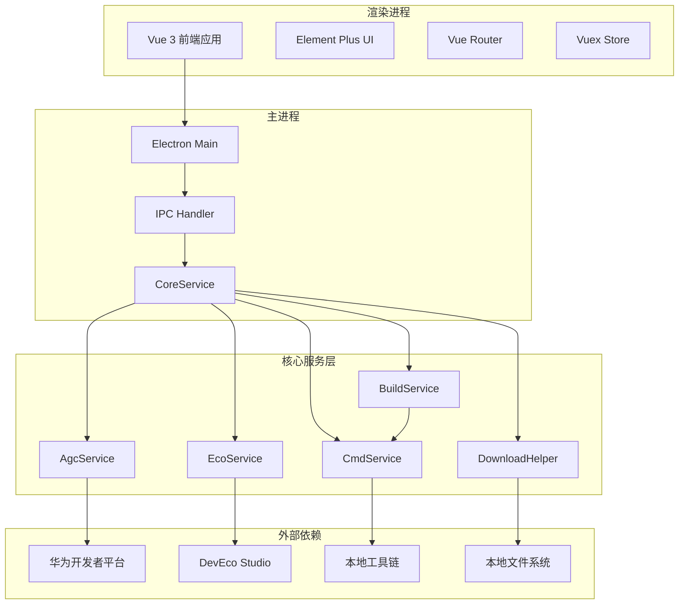
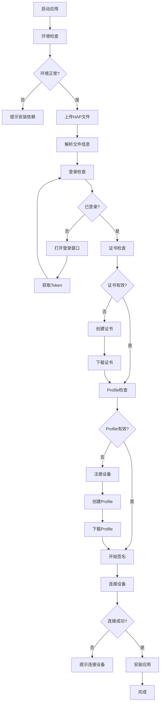
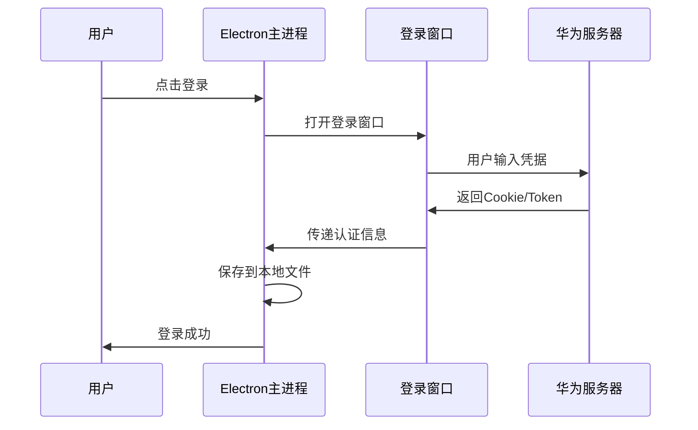
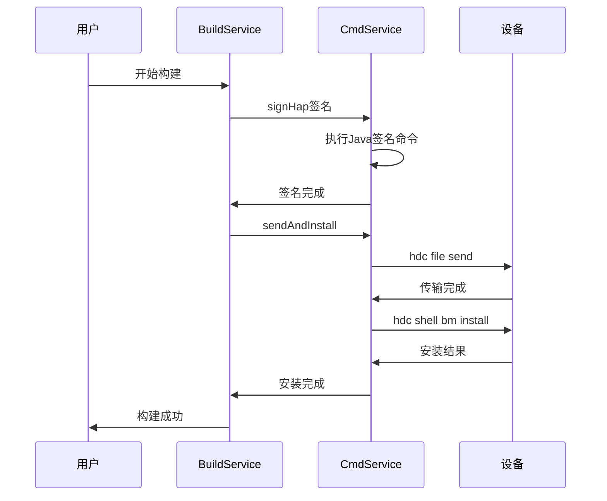

# 鸿蒙应用自动安装工具 - 功能迁移文档

## 文档版本
- **文档版本**: v1.0.0
- **项目版本**: v1.3.0
- **创建日期**: 2025-12-06
- **目标平台**: WPF + WebView2

---

## 目录
1. [项目概述](#1-项目概述)
2. [技术架构分析](#2-技术架构分析)
3. [核心功能模块](#3-核心功能模块)
4. [IPC通信机制](#4-ipc通信机制)
5. [服务层详解](#5-服务层详解)
6. [业务流程图](#6-业务流程图)
7. [WPF集成方案](#7-wpf集成方案)
8. [迁移步骤指南](#8-迁移步骤指南)
9. [关键代码映射](#9-关键代码映射)
10. [注意事项与建议](#10-注意事项与建议)

---

## 1. 项目概述

### 1.1 项目简介
**小白鸿蒙调试工具 (AutoInstaller HarmonyOS)** 是一个基于 Electron + Vue3 的桌面应用程序，用于简化鸿蒙应用的开发、签名、安装和发布流程。

### 1.2 核心价值
- 自动化证书和Profile管理
- 简化应用签名流程
- 支持USB和无线调试安装
- 集成华为AGC和DevEco服务
- 一键式应用构建和部署

### 1.3 技术栈

#### 当前技术栈 (Electron)
```
前端层:
├── Vue 3.2.25 (Composition API)
├── Element Plus 2.8.3 (UI组件库)
├── Vue Router 4.4.5 (路由管理)
├── Vuex 4.1.0 (状态管理)
└── Vite 2.9.5 (构建工具)

桌面层:
├── Electron 32.1.2 (桌面应用框架)
├── Node.js 内置 (运行时)
└── IPC通信 (主进程-渲染进程)

核心服务:
├── simple-git 3.27.0 (Git操作)
├── adm-zip 0.5.16 (ZIP处理)
├── axios 1.7.7 (HTTP请求)
├── mammoth 1.9.0 (DOCX解析)
└── qs 6.13.0 (查询字符串)

命令行工具:
├── HDC (HarmonyOS Device Connector)
├── Java工具链 (签名、打包)
└── 鸿蒙SDK工具集
```

---

## 2. 技术架构分析

### 2.1 整体架构图



### 2.2 目录结构

```
auto-installer/
├── electron/                    # Electron主进程
│   ├── main.js                 # 主进程入口
│   └── preload.js              # 预加载脚本(IPC桥接)
├── core/                       # 核心服务层
│   ├── services.js             # 核心服务协调器
│   ├── agcService.js           # AGC平台服务
│   ├── ecoService.js           # DevEco服务
│   ├── buildService.js         # 构建服务
│   ├── cmdService.js           # 命令行服务
│   └── downloadHelper.js       # 文件下载助手
├── src/                        # Vue前端应用
│   ├── main.js                 # 前端入口
│   ├── App.vue                 # 根组件
│   ├── pages/                  # 页面组件
│   │   └── home/index.vue      # 主页面
│   ├── components/             # UI组件
│   │   ├── publish-steps/      # 构建步骤组件
│   │   ├── file-items/         # 文件项组件
│   │   └── packet-phone/       # 支持组件
│   ├── router/                 # 路由配置
│   ├── store/                  # Vuex状态
│   └── config/                 # 配置文件
├── tools/                      # 工具链(运行时依赖)
│   ├── jbr/                    # Java运行时
│   └── toolchains/             # 鸿蒙工具链
│       ├── hdc                 # 设备连接工具
│       └── lib/                # 签名打包工具
├── store/                      # 证书存储
│   ├── xiaobai.p12             # 密钥库
│   └── xiaobai.csr             # 证书请求
└── package.json                # 项目配置
```

---

## 3. 核心功能模块

### 3.1 功能模块总览

| 模块 | 功能 | 关键文件 |
|------|------|----------|
| 文件管理 | HAP/APP文件上传、解析、图标提取 | services.js, cmdService.js |
| 账户管理 | 华为账号登录、Token管理 | agcService.js, ecoService.js |
| 证书管理 | 密钥库生成、证书申请下载 | buildService.js, cmdService.js |
| Profile管理 | 设备注册、Profile创建下载 | buildService.js, ecoService.js |
| 构建签名 | HAP签名、解包打包 | cmdService.js |
| 设备管理 | USB/无线连接、应用安装 | cmdService.js |

### 3.2 详细功能清单

#### 3.2.1 文件管理模块

| 功能 | 说明 | 实现位置 |
|------|------|----------|
| HAP文件上传 | 支持拖拽上传.hap/.app/.hsp文件 | home/index.vue:changeFile |
| 文件解析 | 解析module.json获取包信息 | cmdService.js:loadModuleJson |
| APP文件处理 | 解包.app文件提取HAP | services.js:saveFileToLocal |
| 图标提取 | 从HAP中提取应用图标 | services.js:parseIcon |
| 大文件选择 | 系统文件对话框选择 | services.js:loadBigHap |

**核心数据结构:**
```javascript
// HAP信息对象
{
  packageName: "com.example.app",  // 包名
  appName: "应用名称",              // 应用名
  versionName: "1.0.0",            // 版本号
  hapPath: "绝对路径",              // 文件路径
  icon: "data:image/png;base64,..."// Base64图标
}
```

#### 3.2.2 账户认证模块

| 功能 | 说明 | API端点 |
|------|------|---------|
| AGC登录 | 华为开发者平台登录 | agcService.js |
| DevEco登录 | DevEco Studio账号登录 | ecoService.js |
| Cookie管理 | 会话Cookie持久化 | hw_cookies.json / ds-authInfo.json |
| Token刷新 | OAuth2 Token自动刷新 | ecoService.js:getTokenBytempToken |

#### 3.2.3 证书管理模块

| 功能 | 说明 | 实现方法 |
|------|------|----------|
| 密钥库生成 | 生成PKCS12密钥库 | cmdService.js:createKeystore |
| CSR生成 | 创建证书签名请求 | cmdService.js:createCsr |
| 证书申请 | 向华为平台申请证书 | ecoService.js:createCert |
| 证书下载 | 下载.cer证书文件 | buildService.js:createAndDownloadDebugCert |
| 证书清理 | 删除本地证书 | buildService.js:clearCerts |

#### 3.2.4 Profile管理模块

| 功能 | 说明 | 文件格式 |
|------|------|----------|
| Profile创建 | 绑定证书、设备、权限 | .p7b |
| 设备注册 | 注册调试设备UDID | DevEco平台 |
| 权限配置 | ACL权限列表配置 | ecoService.js:aclList |
| Profile下载 | 下载签名用Profile | buildService.js:createAndDownloadDebugProfile |

**ACL权限列表:**
```javascript
[
  "ohos.permission.READ_AUDIO",
  "ohos.permission.WRITE_AUDIO",
  "ohos.permission.READ_IMAGEVIDEO",
  "ohos.permission.WRITE_IMAGEVIDEO",
  "ohos.permission.SHORT_TERM_WRITE_IMAGEVIDEO",
  "ohos.permission.READ_CONTACTS",
  "ohos.permission.WRITE_CONTACTS",
  "ohos.permission.SYSTEM_FLOAT_WINDOW",
  "ohos.permission.ACCESS_DDK_USB",
  "ohos.permission.ACCESS_DDK_HID",
  "ohos.permission.INPUT_MONITORING",
  "ohos.permission.INTERCEPT_INPUT_EVENT",
  "ohos.permission.READ_PASTEBOARD"
]
```

#### 3.2.5 构建签名模块

| 功能 | 说明 | 命令行工具 |
|------|------|------------|
| HAP签名 | 对HAP文件进行数字签名 | hap-sign-tool.jar |
| 签名验证 | 验证签名有效性 | verify-app |
| HAP解包 | 解压HAP文件 | app_unpacking_tool.jar |
| HAP打包 | 重新打包HAP | app_packing_tool.jar |

**签名参数:**
```javascript
{
  keystoreFile: "xiaobai.p12",      // 密钥库文件
  keystorePwd: "xiaobai123",        // 密钥库密码
  keyAlias: "xiaobai",              // 密钥别名
  certFile: "xiaobai-debug.cer",    // 证书文件
  profilFile: "xiaobai-debug.p7b",  // Profile文件
  inFile: "input.hap",              // 输入HAP
  outFile: "output-signed.hap"      // 输出HAP
}
```

#### 3.2.6 设备管理模块

| 功能 | 说明 | HDC命令 |
|------|------|---------|
| 设备列表 | 列出已连接设备 | hdc list targets |
| 无线连接 | 通过IP连接设备 | hdc tconn ip:port |
| UDID获取 | 获取设备唯一标识 | hdc shell bm get --udid |
| 文件传输 | 发送文件到设备 | hdc file send src dst |
| 应用安装 | 安装HAP到设备 | hdc shell bm install -p path |

---

## 4. IPC通信机制

### 4.1 Electron IPC架构

当前应用使用Electron的IPC机制实现主进程和渲染进程之间的通信。

#### 4.1.1 通信方式对比

| 通信方式 | 用途 | 示例 |
|----------|------|------|
| ipcRenderer.send | 渲染进程到主进程单向 | 发送命令 |
| ipcMain.on | 主进程监听事件 | 接收命令 |
| webContents.send | 主进程到渲染进程单向 | 发送响应 |
| ipcRenderer.on | 渲染进程监听事件 | 接收响应 |

### 4.2 CoreApi接口清单

**文件位置**: electron/preload.js

| 接口名称 | 功能描述 | 参数 | 返回值 |
|----------|----------|------|--------|
| getEnvInfo | 获取环境信息 | 无 | Promise envInfo |
| uploadHap | 上传HAP文件 | file | Promise hapInfo[] |
| getAccountInfo | 获取账户信息 | 无 | Promise accountInfo |
| getBuildInfo | 获取构建信息 | type | Promise buildInfo |
| checkAccountInfo | 检查账户状态 | commonInfo | Promise accountInfo |
| startBuild | 开始构建 | commonInfo | Promise buildInfo |
| githubBranchs | 获取Git分支 | url | Promise branches[] |
| openBigHap | 打开大文件 | 无 | Promise hapInfo |
| downloadAndInstaller | 下载安装 | url, onProgress | void |
| toLogin | 打开登录 | text | void |

### 4.3 IPC消息映射表

| 渲染进程发送 | 主进程监听 | 主进程响应 |
|--------------|------------|------------|
| getEnvInfo | getEnvInfo | onEnvInfo |
| getAccountInfo | getAccountInfo | onAccountInfo |
| getBuildInfo | getBuildInfo | onBuildInfo |
| uploadHap | uploadHap | onUploadHap |
| checkAccount | checkAccount | onCheckAccount |
| startBuild | startBuild | onStartBuild |
| githubBranchs | githubBranchs | onGithubBranchs / onFailGithubBranchs |
| openBigHap | openBigHap | onOpenBigHap |
| download-file | download-file | download-progress |
| open-window | open-window | - |

---

## 5. 服务层详解

### 5.1 CoreService (核心服务协调器)

**文件位置**: core/services.js

**职责**: 统一协调所有子服务，管理应用状态

**核心属性**:
```javascript
class CoreService {
  dh = new DownloadHelper();      // 下载助手
  agc = new AgcService();         // AGC服务
  cmd = new CmdService();         // 命令行服务
  eco = new EcoService(this);     // DevEco服务
  build = new BuildService(this); // 构建服务
  
  commonInfo = {                  // 通用信息
    packageName: "com.xx.xx",
    appName: "app",
    github: "https://github.com/...",
    branch: "master",
    downloadUrl: "https://xxx",
    deviceIp: "",
    type: 0,
  };
  
  envInfo = { steps: [...] };     // 环境信息
  accountInfo = { steps: [...] }; // 账户信息
  buildInfo = { steps: [...] };   // 构建信息
}
```

**关键方法**:

| 方法名 | 功能 | 参数 |
|--------|------|------|
| registerIpc | 注册所有IPC通信 | win |
| saveFileToLocal | 保存上传的HAP文件 | buffer, filename |
| loadBigHap | 加载大HAP文件 | filePath |
| parseIcon | 解析并提取应用图标 | moduleJson, outPath |
| loginAgc | 打开AGC登录窗口 | url |
| loginEco | 打开DevEco登录 | - |
| repoBranch | 获取Git仓库分支 | repoUrl |
| clearCerts | 清理本地证书 | - |

### 5.2 AgcService (华为AGC服务)

**文件位置**: core/agcService.js

**职责**: 与华为AppGallery Connect平台交互

**API基础配置**:
```javascript
cookie = ""                        // 会话Cookie
csrfToken = ""                     // CSRF令牌
agcteamid = "2850086000506643987" // 团队ID
```

**核心API方法**:

| 方法名 | 功能 | HTTP方法 |
|--------|------|----------|
| userInfo | 获取用户信息 | POST |
| userTeamList | 获取团队列表 | GET |
| projectList | 查询项目列表 | POST |
| createProject | 创建项目 | POST |
| appList | 查询应用列表 | GET |
| createApp | 创建应用 | POST |
| checkPackageName | 检查包名 | POST |
| getCertList | 获取证书列表 | GET |
| createCert | 创建证书 | POST |
| deleteCertList | 删除证书 | DELETE |
| profileList | 查询Profile | GET |
| createProfile | 创建Profile | POST |
| deviceList | 查询设备列表 | GET |
| createDevice | 创建设备 | POST |
| downloadObj | 下载对象 | POST |

### 5.3 EcoService (DevEco服务)

**文件位置**: core/ecoService.js

**职责**: 与DevEco Studio平台交互

**API基础配置**:
```javascript
oauth2Token = ""  // OAuth2访问令牌
agcteamid = ""    // 团队ID
userId = ""       // 用户ID
nickName = ""     // 用户昵称
```

**核心API方法**:

| 方法名 | 功能 | 端点 |
|--------|------|------|
| getTokenBytempToken | 临时令牌换取Token | /auth/api/temptoken/check |
| userTeamList | 获取团队列表 | /user-permission-service/v1/user-team-list |
| getCertList | 获取证书列表 | /harmony-cert-manage/v1/cert/list |
| createCert | 创建证书 | /harmony-cert-manage/v1/cert/add |
| deleteCertList | 删除证书 | /harmony-cert-manage/v1/cert/delete |
| createProfile | 创建Profile | /provision-manage/v1/ide/test/provision/add |
| deviceList | 查询设备列表 | /device-manage/v1/device/list |
| createDevice | 创建设备 | /device-manage/v1/device/add |
| downloadObj | 下载对象 | /app-manage/v1/objects/url/reapply |

### 5.4 BuildService (构建服务)

**文件位置**: core/buildService.js

**职责**: 管理构建流程、证书和Profile

**配置对象**:
```javascript
ecoConfig = {
  teamId: "",
  uid: "",
  keystore: "",
  storepass: "xiaobai123",
  keyAlias: "xiaobai",
  outPath: "",
  debugCert: {},
  debugProfile: {}
};
```

**核心方法**:

| 方法名 | 功能 |
|--------|------|
| checkEcoAccount | 检查DevEco账户状态 |
| startBuild | 开始构建流程 |
| sginAndInstall | 签名并安装 |
| createAndDownloadDebugCert | 创建并下载调试证书 |
| createAndDownloadDebugProfile | 创建并下载调试Profile |
| clearCerts | 清理证书 |
| startStep | 执行步骤 |
| finishStep | 完成步骤 |
| failStep | 步骤失败 |
| updateStep | 更新步骤状态 |

### 5.5 CmdService (命令行服务)

**文件位置**: core/cmdService.js

**职责**: 执行命令行工具操作

**工具路径配置**:
```javascript
JavaHome = "tools/jbr"           // Java运行时
SdkHome = "tools/toolchains"     // SDK工具链
hdc = SdkHome + "/hdc"           // HDC工具
sginJar = SdkHome + "/lib/hap-sign-tool.jar"  // 签名工具
```

**核心方法**:

| 方法名 | 功能 | 命令 |
|--------|------|------|
| exeCmd | 执行命令 | exec |
| deviceList | 设备列表 | hdc list targets |
| connectDevice | 连接设备 | hdc tconn |
| getUdid | 获取UDID | hdc shell bm get --udid |
| sendAndInstall | 发送并安装 | hdc file send + bm install |
| sendFile | 发送文件 | hdc file send |
| installHap | 安装HAP | hdc shell bm install |
| loadModuleJson | 加载module.json | AdmZip |
| signHap | 签名HAP | java -jar hap-sign-tool.jar |
| createCsr | 创建CSR | keytool -certreq |
| createKeystore | 创建密钥库 | keytool -genkeypair |
| verifyApp | 验证应用 | java -jar verify-app |
| unpackHap | 解包HAP | java -jar app_unpacking_tool.jar |
| packHap | 打包HAP | java -jar app_packing_tool.jar |

### 5.6 DownloadHelper (下载助手)

**文件位置**: core/downloadHelper.js

**职责**: 文件下载和本地存储管理

**目录配置**:
```javascript
configDir = "~/.autoPublisher/config"   // 配置目录
codeDir = "~/.autoPublisher/code"       // 代码目录
hapDir = "~/.autoPublisher/haps"        // HAP目录
signedDir = "~/.autoPublisher/signeds"  // 签名目录
```

**核心方法**:

| 方法名 | 功能 |
|--------|------|
| downloadFile | 下载文件到配置目录 |
| downloadAndInstallFile | 下载并安装文件 |
| installFile | 执行安装文件 |
| writeObjToFile | 写入JSON对象到文件 |
| readFileToObj | 从文件读取JSON对象 |
| readPng | 读取PNG为Base64 |
| cloneGit | 克隆Git仓库 |

---

## 6. 业务流程图

### 6.1 主流程图



### 6.2 登录认证流程



### 6.3 签名安装流程



---

## 7. WPF集成方案

### 7.1 架构映射

| Electron组件 | WPF对应方案 |
|--------------|-------------|
| Electron Main | WPF主程序 |
| Electron Renderer | WebView2 |
| IPC通信 | WebView2.CoreWebView2.PostWebMessageAsJson |
| Node.js | C# System.Diagnostics.Process |
| fs模块 | System.IO |
| net模块 | HttpClient |
| child_process | Process.Start |

### 7.2 WebView2通信方案

#### 7.2.1 C#端注册消息处理

```csharp
// MainWindow.xaml.cs
public partial class MainWindow : Window
{
    private CoreService _coreService;
    
    public MainWindow()
    {
        InitializeComponent();
        InitializeWebView();
        _coreService = new CoreService();
    }
    
    private async void InitializeWebView()
    {
        await webView.EnsureCoreWebView2Async();
        
        // 注册消息处理
        webView.CoreWebView2.WebMessageReceived += CoreWebView2_WebMessageReceived;
        
        // 注入JS桥接对象
        webView.CoreWebView2.AddHostObjectToScript("coreApi", new CoreApiHost(this));
    }
    
    private async void CoreWebView2_WebMessageReceived(object sender, 
        CoreWebView2WebMessageReceivedEventArgs e)
    {
        var message = JsonSerializer.Deserialize<IpcMessage>(e.WebMessageAsJson);
        
        switch (message.Action)
        {
            case "getEnvInfo":
                var envInfo = _coreService.GetEnvInfo();
                SendToWeb("onEnvInfo", envInfo);
                break;
            case "uploadHap":
                var hapInfo = await _coreService.SaveFileToLocal(
                    message.Data.Buffer, message.Data.FileName);
                SendToWeb("onUploadHap", hapInfo);
                break;
            case "checkAccount":
                await _coreService.Build.CheckEcoAccount(message.Data);
                SendToWeb("onCheckAccount", _coreService.GetAccountInfo());
                break;
            case "startBuild":
                await _coreService.Build.StartBuild(message.Data);
                SendToWeb("onStartBuild", _coreService.GetBuildInfo());
                break;
            // ... 其他消息处理
        }
    }
    
    public void SendToWeb(string action, object data)
    {
        var message = JsonSerializer.Serialize(new { action, data });
        webView.CoreWebView2.PostWebMessageAsJson(message);
    }
}
```

#### 7.2.2 前端JS桥接

```javascript
// 替换原有的preload.js逻辑
window.CoreApi = {
    getEnvInfo: () => {
        return new Promise((resolve) => {
            const handler = (event) => {
                const data = JSON.parse(event.data);
                if (data.action === 'onEnvInfo') {
                    window.chrome.webview.removeEventListener('message', handler);
                    resolve(data.data);
                }
            };
            window.chrome.webview.addEventListener('message', handler);
            window.chrome.webview.postMessage(JSON.stringify({ action: 'getEnvInfo' }));
        });
    },
    
    uploadHap: (file) => {
        return new Promise((resolve) => {
            const handler = (event) => {
                const data = JSON.parse(event.data);
                if (data.action === 'onUploadHap') {
                    window.chrome.webview.removeEventListener('message', handler);
                    resolve(data.data);
                }
            };
            window.chrome.webview.addEventListener('message', handler);
            
            // 读取文件为ArrayBuffer
            const reader = new FileReader();
            reader.onload = () => {
                const buffer = Array.from(new Uint8Array(reader.result));
                window.chrome.webview.postMessage(JSON.stringify({
                    action: 'uploadHap',
                    data: { buffer, fileName: file.name }
                }));
            };
            reader.readAsArrayBuffer(file.raw);
        });
    },
    
    checkAccountInfo: (commonInfo) => {
        return new Promise((resolve) => {
            const handler = (event) => {
                const data = JSON.parse(event.data);
                if (data.action === 'onCheckAccount') {
                    window.chrome.webview.removeEventListener('message', handler);
                    resolve(data.data);
                }
            };
            window.chrome.webview.addEventListener('message', handler);
            window.chrome.webview.postMessage(JSON.stringify({
                action: 'checkAccount',
                data: commonInfo
            }));
        });
    },
    
    startBuild: (commonInfo) => {
        return new Promise((resolve) => {
            const handler = (event) => {
                const data = JSON.parse(event.data);
                if (data.action === 'onStartBuild') {
                    window.chrome.webview.removeEventListener('message', handler);
                    resolve(data.data);
                }
            };
            window.chrome.webview.addEventListener('message', handler);
            window.chrome.webview.postMessage(JSON.stringify({
                action: 'startBuild',
                data: commonInfo
            }));
        });
    }
    // ... 其他API类似实现
};
```

### 7.3 C#服务层实现

#### 7.3.1 核心服务类结构

```csharp
// Services/CoreService.cs
public class CoreService
{
    public DownloadHelper Dh { get; }
    public AgcService Agc { get; }
    public CmdService Cmd { get; }
    public EcoService Eco { get; }
    public BuildService Build { get; }
    
    public CommonInfo CommonInfo { get; set; }
    public EnvInfo EnvInfo { get; set; }
    public AccountInfo AccountInfo { get; set; }
    public BuildInfo BuildInfo { get; set; }
    
    public CoreService()
    {
        Dh = new DownloadHelper();
        Agc = new AgcService();
        Cmd = new CmdService();
        Eco = new EcoService(this);
        Build = new BuildService(this);
        
        InitializeInfo();
    }
}
```

#### 7.3.2 命令行服务

```csharp
// Services/CmdService.cs
public class CmdService
{
    private string JavaHome { get; set; }
    private string SdkHome { get; set; }
    private string Hdc { get; set; }
    private string SignJar { get; set; }
    
    public CmdService()
    {
        var basePath = AppDomain.CurrentDomain.BaseDirectory;
        JavaHome = Path.Combine(basePath, "tools", "jbr");
        SdkHome = Path.Combine(basePath, "tools", "toolchains");
        Hdc = Path.Combine(SdkHome, "hdc.exe");
        SignJar = Path.Combine(SdkHome, "lib", "hap-sign-tool.jar");
    }
    
    public async Task<string> ExeCmd(string cmd, string workDir = null)
    {
        var process = new Process
        {
            StartInfo = new ProcessStartInfo
            {
                FileName = "cmd.exe",
                Arguments = $"/c {cmd}",
                WorkingDirectory = workDir ?? Directory.GetCurrentDirectory(),
                RedirectStandardOutput = true,
                RedirectStandardError = true,
                UseShellExecute = false,
                CreateNoWindow = true
            }
        };
        
        process.Start();
        var output = await process.StandardOutput.ReadToEndAsync();
        await process.WaitForExitAsync();
        return output;
    }
    
    public async Task<List<string>> DeviceList()
    {
        var result = await ExeCmd($"\"{Hdc}\" list targets");
        if (result.Contains("[Empty]"))
            return new List<string>();
        return result.Split('\n').Where(d => !string.IsNullOrEmpty(d)).ToList();
    }
    
    public async Task ConnectDevice(string device)
    {
        var result = await ExeCmd($"\"{Hdc}\" tconn {device}");
        if (string.IsNullOrEmpty(result) || result.Contains("Connect failed"))
            throw new Exception($"连接失败，请检查地址: {device}");
    }
    
    public async Task<string> GetUdid(string device)
    {
        var deviceArg = string.IsNullOrEmpty(device) ? "" : $"-t {device}";
        var result = await ExeCmd($"\"{Hdc}\" {deviceArg} shell bm get --udid");
        if (result.Contains("Not match target founded"))
            throw new Exception($"未发现设备: {device}");
        return result.Split('\n')[1].Trim();
    }
    
    public async Task SignHap(SignConfig config)
    {
        var javaPath = Path.Combine(JavaHome, "bin", "java.exe");
        var signParam = $"-mode \"localSign\" -keyAlias \"{config.KeyAlias}\" " +
            $"-appCertFile \"{config.CertFile}\" -profileFile \"{config.ProfileFile}\" " +
            $"-inFile \"{config.InFile}\" -signAlg \"SHA256withECDSA\" " +
            $"-keystoreFile \"{config.KeystoreFile}\" -keystorePwd \"{config.KeystorePwd}\" " +
            $"-keyPwd \"{config.KeystorePwd}\" -outFile \"{config.OutFile}\" -signCode \"1\"";
        
        await ExeCmd($"\"{javaPath}\" -jar \"{SignJar}\" sign-app {signParam}");
    }
    
    public async Task SendAndInstall(string filePath, string deviceIp)
    {
        string deviceKey;
        if (!string.IsNullOrEmpty(deviceIp))
        {
            deviceKey = deviceIp;
            await ConnectDevice(deviceKey);
        }
        else
        {
            var devices = await DeviceList();
            if (devices.Count == 0)
                throw new Exception("请连接手机，并开启开发者模式和USB调试!");
            deviceKey = devices[0].Trim();
        }
        
        await SendFile(deviceKey, filePath);
        await InstallHap(deviceKey);
    }
    
    private async Task SendFile(string device, string filePath)
    {
        var deviceArg = string.IsNullOrEmpty(device) ? "" : $"-t {device}";
        await ExeCmd($"\"{Hdc}\" {deviceArg} shell rm -r data/local/tmp/hap");
        await ExeCmd($"\"{Hdc}\" {deviceArg} shell mkdir -p data/local/tmp/hap");
        var result = await ExeCmd($"\"{Hdc}\" {deviceArg} file send \"{filePath}\" data/local/tmp/hap/");
        
        if (!result.Contains("finish"))
            throw new Exception($"传输失败: {result}");
    }
    
    private async Task InstallHap(string device)
    {
        var deviceArg = string.IsNullOrEmpty(device) ? "" : $"-t {device}";
        var result = await ExeCmd($"\"{Hdc}\" {deviceArg} shell bm install -p data/local/tmp/hap/");
        
        if (!result.Contains("successfully"))
            throw new Exception($"安装失败: {result}");
    }
}
```

#### 7.3.3 HTTP服务

```csharp
// Services/EcoService.cs
public class EcoService
{
    private readonly HttpClient _httpClient;
    private readonly CoreService _core;
    
    public string OAuth2Token { get; set; }
    public string TeamId { get; set; }
    public string UserId { get; set; }
    public string NickName { get; set; }
    
    public EcoService(CoreService core)
    {
        _core = core;
        _httpClient = new HttpClient();
    }
    
    private async Task<T> BaseRequest<T>(string url, object data = null,
        HttpMethod method = null, Dictionary<string, string> headers = null)
    {
        method ??= HttpMethod.Post;
        
        var request = new HttpRequestMessage(method, url);
        request.Headers.Add("oauth2Token", OAuth2Token ?? "");
        request.Headers.Add("teamId", TeamId ?? "");
        request.Headers.Add("uid", UserId ?? "");
        
        if (headers != null)
        {
            foreach (var header in headers)
                request.Headers.Add(header.Key, header.Value);
        }
        
        if (data != null && method != HttpMethod.Get)
        {
            var json = JsonSerializer.Serialize(data);
            request.Content = new StringContent(json, Encoding.UTF8, "application/json");
        }
        
        var response = await _httpClient.SendAsync(request);
        var content = await response.Content.ReadAsStringAsync();
        return JsonSerializer.Deserialize<T>(content);
    }
    
    public async Task<CertListResponse> GetCertList()
    {
        return await BaseRequest<CertListResponse>(
            "https://connect-api.cloud.huawei.com/api/cps/harmony-cert-manage/v1/cert/list",
            method: HttpMethod.Get);
    }
    
    public async Task<CreateCertResponse> CreateCert(string name, int type, string csr)
    {
        return await BaseRequest<CreateCertResponse>(
            "https://connect-api.cloud.huawei.com/api/cps/harmony-cert-manage/v1/cert/add",
            new { csr, certName = name, certType = type });
    }
    
    public async Task<DeviceListResponse> DeviceList()
    {
        return await BaseRequest<DeviceListResponse>(
            "https://connect-api.cloud.huawei.com/api/cps/device-manage/v1/device/list?start=1&pageSize=100&encodeFlag=0",
            method: HttpMethod.Get);
    }
    
    public async Task<CreateProfileResponse> CreateProfile(string name, string certId,
        string packageName, List<string> deviceIds, ModuleJson moduleJson)
    {
        var aclList = GetAcl(moduleJson);
        return await BaseRequest<CreateProfileResponse>(
            "https://connect-api.cloud.huawei.com/api/cps/provision-manage/v1/ide/test/provision/add",
            new
            {
                provisionName = name,
                aclPermissionList = aclList,
                deviceList = deviceIds,
                certList = new[] { certId },
                packageName
            });
    }
}
```

---

## 8. 迁移步骤指南

### 8.1 迁移清单

| 步骤 | 任务 | 优先级 | 复杂度 |
|------|------|--------|--------|
| 1 | 创建WPF项目结构 | 高 | 低 |
| 2 | 集成WebView2控件 | 高 | 低 |
| 3 | 实现IPC通信桥接 | 高 | 中 |
| 4 | 迁移CmdService | 高 | 中 |
| 5 | 迁移DownloadHelper | 高 | 低 |
| 6 | 迁移EcoService | 高 | 中 |
| 7 | 迁移AgcService | 中 | 中 |
| 8 | 迁移BuildService | 高 | 高 |
| 9 | 迁移CoreService | 高 | 中 |
| 10 | 前端JS桥接适配 | 高 | 低 |
| 11 | 工具链集成 | 高 | 低 |
| 12 | 测试验证 | 高 | 中 |

### 8.2 详细迁移步骤

#### 步骤1: 创建WPF项目

```bash
dotnet new wpf -n HarmonyAutoInstaller
cd HarmonyAutoInstaller
dotnet add package Microsoft.Web.WebView2
dotnet add package System.Text.Json
```

#### 步骤2: 项目结构

```
HarmonyAutoInstaller/
├── MainWindow.xaml           # 主窗口
├── MainWindow.xaml.cs        # 主窗口代码
├── App.xaml                  # 应用配置
├── Services/                 # 服务层
│   ├── CoreService.cs
│   ├── AgcService.cs
│   ├── EcoService.cs
│   ├── BuildService.cs
│   ├── CmdService.cs
│   └── DownloadHelper.cs
├── Models/                   # 数据模型
│   ├── CommonInfo.cs
│   ├── EnvInfo.cs
│   ├── AccountInfo.cs
│   ├── BuildInfo.cs
│   └── HapInfo.cs
├── wwwroot/                  # 前端资源
│   └── (Vue构建输出)
└── tools/                    # 工具链
    ├── jbr/
    └── toolchains/
```

#### 步骤3: 主窗口配置

```xml
<!-- MainWindow.xaml -->
<Window x:Class="HarmonyAutoInstaller.MainWindow"
        xmlns="http://schemas.microsoft.com/winfx/2006/xaml/presentation"
        xmlns:x="http://schemas.microsoft.com/winfx/2006/xaml"
        xmlns:wv2="clr-namespace:Microsoft.Web.WebView2.Wpf;assembly=Microsoft.Web.WebView2.Wpf"
        Title="小白鸿蒙调试工具" Height="600" Width="1000">
    <Grid>
        <wv2:WebView2 x:Name="webView" Source="wwwroot/index.html"/>
    </Grid>
</Window>
```

### 8.3 关键迁移点

#### 8.3.1 文件操作迁移

| Node.js | C# |
|---------|-----|
| fs.readFileSync | File.ReadAllBytes |
| fs.writeFileSync | File.WriteAllBytes |
| fs.existsSync | File.Exists |
| fs.mkdirSync | Directory.CreateDirectory |
| fs.readdirSync | Directory.GetFiles |
| fs.unlinkSync | File.Delete |
| path.join | Path.Combine |
| path.dirname | Path.GetDirectoryName |
| path.basename | Path.GetFileName |

#### 8.3.2 HTTP请求迁移

| Electron net | C# HttpClient |
|--------------|---------------|
| net.request | new HttpRequestMessage |
| request.on('response') | await SendAsync |
| response.on('data') | ReadAsStringAsync |
| request.write | StringContent |
| request.end | SendAsync |

#### 8.3.3 进程执行迁移

| Node.js | C# |
|---------|-----|
| child_process.exec | Process.Start |
| exec callback | WaitForExitAsync |
| stdout | StandardOutput |
| stderr | StandardError |

---

## 9. 关键代码映射

### 9.1 数据模型

```csharp
// Models/CommonInfo.cs
public class CommonInfo
{
    public string PackageName { get; set; }
    public string AppName { get; set; }
    public string Github { get; set; }
    public string Branch { get; set; }
    public string DownloadUrl { get; set; }
    public string DeviceIp { get; set; }
    public string HapPath { get; set; }
    public int Type { get; set; }
}

// Models/HapInfo.cs
public class HapInfo
{
    public string PackageName { get; set; }
    public string AppName { get; set; }
    public string VersionName { get; set; }
    public string HapPath { get; set; }
    public string Icon { get; set; }
}

// Models/StepInfo.cs
public class StepInfo
{
    public string Name { get; set; }
    public bool Finish { get; set; }
    public string Value { get; set; }
    public bool Loading { get; set; }
    public string Message { get; set; }
    public string Url { get; set; }
}

// Models/EnvInfo.cs
public class EnvInfo
{
    public List<StepInfo> Steps { get; set; }
}

// Models/AccountInfo.cs
public class AccountInfo
{
    public List<StepInfo> Steps { get; set; }
}

// Models/BuildInfo.cs
public class BuildInfo
{
    public List<StepInfo> Steps { get; set; }
    public List<StepInfo> Install { get; set; }
}

// Models/SignConfig.cs
public class SignConfig
{
    public string KeystoreFile { get; set; }
    public string KeystorePwd { get; set; }
    public string KeyAlias { get; set; }
    public string CertFile { get; set; }
    public string ProfileFile { get; set; }
    public string InFile { get; set; }
    public string OutFile { get; set; }
}

// Models/EcoConfig.cs
public class EcoConfig
{
    public string TeamId { get; set; }
    public string Uid { get; set; }
    public string Keystore { get; set; }
    public string Storepass { get; set; } = "xiaobai123";
    public string KeyAlias { get; set; } = "xiaobai";
    public string OutPath { get; set; }
    public CertInfo DebugCert { get; set; }
    public ProfileInfo DebugProfile { get; set; }
}
```

### 9.2 ZIP处理

```csharp
// 使用System.IO.Compression替代adm-zip
using System.IO.Compression;

public class ZipHelper
{
    public static ModuleJson LoadModuleJson(string hapPath)
    {
        using var archive = ZipFile.OpenRead(hapPath);
        var entry = archive.GetEntry("module.json");
        if (entry == null) return null;
        
        using var stream = entry.Open();
        using var reader = new StreamReader(stream);
        var content = reader.ReadToEnd();
        return JsonSerializer.Deserialize<ModuleJson>(content);
    }
    
    public static void ExtractToDirectory(string zipPath, string destPath)
    {
        if (Directory.Exists(destPath))
            Directory.Delete(destPath, true);
        ZipFile.ExtractToDirectory(zipPath, destPath);
    }
}
```

---

## 10. 注意事项与建议

### 10.1 安全注意事项

1. **证书存储**: 密钥库文件(.p12)应加密存储，避免明文保存密码
2. **Token管理**: OAuth2 Token应安全存储，考虑使用Windows凭据管理器
3. **Cookie处理**: 会话Cookie应加密存储，定期清理过期数据
4. **文件权限**: 配置目录应设置适当的访问权限

### 10.2 性能优化建议

1. **异步操作**: 所有IO和网络操作使用async/await
2. **进度反馈**: 长时间操作提供进度回调
3. **缓存策略**: 证书和Profile信息本地缓存
4. **连接复用**: HttpClient实例复用

### 10.3 兼容性注意

1. **路径分隔符**: 使用Path.Combine处理跨平台路径
2. **编码问题**: 文件读写统一使用UTF-8
3. **工具链版本**: 确保HDC和Java工具链版本兼容
4. **WebView2运行时**: 需要安装WebView2运行时

### 10.4 测试建议

1. **单元测试**: 为每个Service编写单元测试
2. **集成测试**: 测试完整的签名安装流程
3. **设备测试**: 测试USB和无线两种连接方式
4. **异常测试**: 测试网络异常、设备断开等场景

### 10.5 部署建议

1. **工具链打包**: 将tools目录打包到安装程序
2. **运行时检查**: 启动时检查Java和HDC可用性
3. **自动更新**: 考虑实现应用自动更新机制
4. **日志记录**: 添加详细的日志记录便于问题排查

---

## 附录

### A. API端点汇总

#### DevEco API
| 端点 | 方法 | 功能 |
|------|------|------|
| /auth/api/temptoken/check | GET | 临时令牌验证 |
| /auth/api/jwToken/check | GET | JWT令牌验证 |
| /user-permission-service/v1/user-team-list | GET | 团队列表 |
| /harmony-cert-manage/v1/cert/list | GET | 证书列表 |
| /harmony-cert-manage/v1/cert/add | POST | 创建证书 |
| /harmony-cert-manage/v1/cert/delete | DELETE | 删除证书 |
| /provision-manage/v1/ide/test/provision/add | POST | 创建Profile |
| /device-manage/v1/device/list | GET | 设备列表 |
| /device-manage/v1/device/add | POST | 添加设备 |
| /app-manage/v1/objects/url/reapply | POST | 获取下载URL |

#### AGC API
| 端点 | 方法 | 功能 |
|------|------|------|
| /AGCHomePageOrchestration/getUserInfo | POST | 用户信息 |
| /user-permission-service/v1/user-team-list | GET | 团队列表 |
| /project-management-service/v1/projectList | POST | 项目列表 |
| /project-management-service/v1/projects | POST | 创建项目 |
| /app-manage/v1/app/list | GET | 应用列表 |
| /app-manage/v1/app | POST | 创建应用 |
| /harmony-cert-manage/v1/cert/list | GET | 证书列表 |
| /harmony-cert-manage/v1/cert | POST | 创建证书 |
| /provision-manage/v1/provision/list | GET | Profile列表 |
| /provision-manage/v1/provision | POST | 创建Profile |
| /device-manage/v1/device/list | GET | 设备列表 |
| /device-manage/v1/device | POST | 添加设备 |

### B. HDC命令参考

| 命令 | 功能 | 示例 |
|------|------|------|
| list targets | 列出设备 | hdc list targets |
| tconn | 无线连接 | hdc tconn 192.168.1.100:5555 |
| shell | 执行Shell | hdc shell ls |
| file send | 发送文件 | hdc file send local remote |
| file recv | 接收文件 | hdc file recv remote local |
| install | 安装应用 | hdc install app.hap |
| uninstall | 卸载应用 | hdc uninstall com.example |
| shell bm get --udid | 获取UDID | hdc shell bm get --udid |
| shell bm install | 安装HAP | hdc shell bm install -p path |

### C. 配置文件格式

#### eco_config.json
```json
{
  "teamId": "",
  "uid": "",
  "keystore": "path/to/xiaobai.p12",
  "storepass": "xiaobai123",
  "keyAlias": "xiaobai",
  "outPath": "",
  "debugCert": {
    "id": "",
    "name": "xiaobai-debug",
    "path": "path/to/xiaobai-debug.cer"
  },
  "debugProfile": {
    "name": "xiaobai-debug_com_example_app.p7b",
    "path": "path/to/profile.p7b"
  }
}
```

#### ds-authInfo.json
```json
{
  "accessToken": "oauth2_token_here",
  "userId": "user_id",
  "nickName": "用户昵称"
}
```

---

**文档结束**

如有问题或建议，请联系开发团队。
